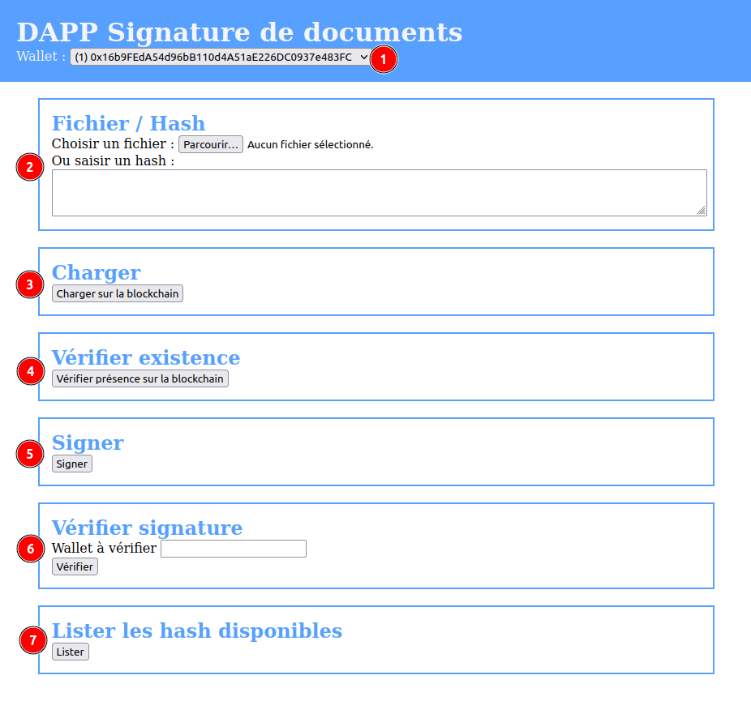

= Projet de blockchain ENSIBS Cyberdata S8

* Alexendre Lenfantin
* Axel Bacrie
* Mehdi Khalil

== Enoncé

* **Projet** : Explorer un Ensemble de Données pour Détecter les Fraudes en Ethereum puis Développer une Application WEB3 Décentralisée (DApp)
* **Groups** : 3 élèves max.
* **Présentation** : Le dernier TD.
* **Durée** : 5 Séance de TDs.
* **Eléments attendus** : Présenter les réponses aux deux premières questions puis le code et le fonctionnement de l'application.

=== Première partie

Les deux questions suivantes concernent l’ensemble de donnée (Ethereum Fraud Detection Dataset https://www.kaggle.com/datasets/vagifa/ethereum-frauddetection-dataset):

* **Question 1** : Quelles sont les caractéristiques utilisées pour détecter les fraudes en Ethereum ?
* **Question 2** : Implémenter une technique pour supprimer les caractéristiques corrélées.

Les éléments de réponce sont donnés en annexe à la fin de ce document.

=== Deuxième partie

Implémenter une application DAPP, comme: ToDo list, voting...
Les liens suivants présent des idées:

* Créer une DApp de A à Z | Foundry, NextJS, Wagmi, Viem, Typescript: https://www.youtube.com/watch?v=pTqYEretjs4&t=5127s
* Une application de vote-Ethereum for web developers, https://medium.com/@mvmurthy/ethereum-for-web-developers-890be23d1d0c
* ToDo List: How to Build Ethereum Dapp with React.js· Complete Step-By-Step Guide, https://www.dappuniversity.com/articles/ethereum-dapp-react-tutorial

Les étapes de développement:

1. Développer le contrat intelligent, ce sera le backend de l’application.
2. Déployer le contrat sur un nœud local.
3. Développer le frontend de l’application.

== Notre projet : Une application de signature de documents

Un utilisateur doit pouvoir ajouter un document à signer, signer un document, vérifier qui à signé le document. <br>
Un document est représenté par son hash (fait dans le front). <br>

=== Methode smart contract

* Ajout de document (hash avec id)
* Verification du document
* Signer un document
* Verification des signataires
  
=== Elements d'interface

On souhaite réaliser une application one page qui se découpe en plusieur pages :

* Déposer un document.
* Récupérer son hash.
* Ajouter le document à la blockchain pour être signé.
* Vérifier si le document est présent sur la blockchain.
* Vérifier si un wallet a signé un document.

=== Lancer le projet

Le projet nécessite nodejs, et ganache-cli.

Vous pouvez trouver le code dans le repo github : https://github.com/noxxou/blockchain

1. Compiler le smart contract :

```bash
npm run compile
```

2. Lancer ganache-cli :

```bash
ganache-cli
```

3. Initialiser l'application :

```bash
npm run startapp
```

4. Puis ouvrir le fichier app.html dans le navigateur.

### L'application

.Capture d'écran de l'application.


On retrouve différents éléments qui permettent d'utiliser les actions cités plu haut.

. Un menu déroulant permettant de sélectionner le wallet avec lequel on travaille. Cela n'est possible que dans ce contexte où nous utilisons ganache-cli.
. **Fichier / Hash** : permet de déposer un fichier (son hash directement donné en-dessous) ou de directement donner un hash. Ce hash sera pris en compte pour toutes les prochaines fonctionalitées.
. **Charger** : permet de poster le hash sur la blockchain pour pouvoir le signer.
. **Vérifier** : permet de vérifier si le hash à déjà été importé.
. **Signer** : signe le hash avec le wallet actuel.
. **Vérifier signature** : En donnant une adresse de wallet au format `0x....`, on peut vérifier su cette adresse a signé le fichier.
. **Lister** : permet de lister les hash sur la block chaine et indique le nombre de signataire.